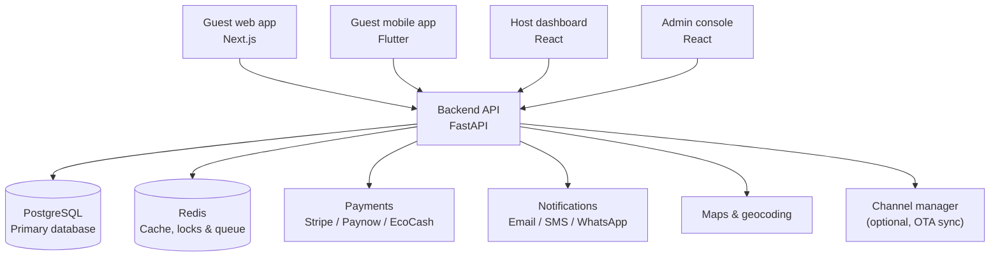

# Booking Platform — Product & Technical Plan

> A hotel & lodging booking marketplace — startup concept plan covering features, applications, system architecture, tech stack, and build strategy.

## Table of contents

1. [Vision](#1-vision)
2. [Core features](#2-core-features)
3. [Applications to build](#3-applications-to-build)
4. [System architecture](#4-system-architecture)
5. [Tech stack](#5-tech-stack)
6. [Data model](#6-data-model)
7. [Hard technical problems to solve early](#7-hard-technical-problems-to-solve-early)
8. [Security & compliance](#8-security--compliance)
9. [Business model](#9-business-model)
10. [Build roadmap](#10-build-roadmap)
11. [Design system](#11-design-system)

---

## 1. Vision

A two-sided marketplace for lodging — think a leaner, regionally-aware take on Booking.com/Airbnb — connecting guests searching for a place to stay with hosts (hotels, lodges, guesthouses) who list rooms and manage availability, rates, and bookings. The platform sits in the middle, taking a commission per booking and providing the trust, payments, and discovery layer both sides rely on.

---

## 2. Core features

### Guest-facing

- Search & discovery — location, dates, guest count, filters (price, star rating, amenities, property type, distance from a landmark)
- Property page — photo gallery, room types & rate plans, amenities, house rules, cancellation policy, map, reviews
- Real-time availability with instant booking (no waiting on host confirmation)
- Transparent pricing breakdown at checkout — room rate + taxes + fees, no hidden charges
- Multi-room / multi-night booking with per-room capacity validation
- Checkout add-ons: breakfast, airport transfer, late checkout, extra bed
- Multiple payment methods: card, mobile money, pay-at-property deposit option
- Instant e-voucher with QR code for fast check-in
- Guest account: booking history, wishlist, saved payment methods, loyalty points
- Self-service modify/cancel with real-time refund calculation
- Verified reviews — only guests with a completed stay can review
- In-app messaging with the property before/during the stay
- Multi-currency display and multi-language UI
- Notifications across email, SMS, push, and WhatsApp
- Corporate/group booking with invoice billing

### Host / property-facing

- Onboarding wizard: business details, verification docs, payout details
- Room type, rate plan, and inventory management (seasonal pricing, length-of-stay discounts, promo codes)
- Availability calendar with block-out dates and an overbooking buffer
- Booking inbox and check-in/check-out workflow
- Lightweight front-desk tools: room status board, guest folio
- Staff accounts with role-based permissions (owner, manager, front desk, housekeeping)
- Payout dashboard: earnings, commission deducted, payout history
- Analytics: occupancy rate, ADR, RevPAR, booking source, repeat-guest rate
- Review response tools, automated pre-arrival/post-stay messaging
- Optional OTA channel-manager sync so hosts don't juggle duplicate calendars

### Platform / admin

- Property approval and KYC verification queue
- Commission configuration (flat, tiered, or per-category)
- Batch payouts to hosts (bank transfer, mobile money)
- Dispute and support ticketing
- Fraud and fake-listing detection
- Platform analytics: GMV, take rate, active listings, demand heatmaps, conversion funnel
- Promotions engine and featured-listing placement (monetization lever)
- SEO tooling: city landing pages, blog, structured data

### Differentiating features

- AI natural-language search — e.g. "quiet place near Victoria Falls for two, under $80/night this weekend" parsed into structured filters
- Dynamic pricing suggestions for hosts based on demand/seasonality
- Mobile money (EcoCash / OneMoney / Paynow) as a first-class payment method, not a bolt-on
- WhatsApp Business API for confirmations and support
- Low-data / offline-tolerant mode for the web and Flutter apps, given variable connectivity
- USSD/SMS booking fallback if targeting rural or feature-phone markets
- Verified-stay-only reviews to build trust faster than incumbents with fake-review problems
- Bundled local experiences (transfers, tours) as checkout upsells
- Referral program and a simple loyalty tier

---

## 3. Applications to build

| # | Application | Platform | Purpose |
|---|---|---|---|
| 1 | Guest web app | Next.js | Public site + booking flow, SEO-facing |
| 2 | Guest mobile app | Flutter (iOS + Android) | Same flow, native, push notifications |
| 3 | Host dashboard | React SPA | Inventory, rates, bookings, payouts |
| 4 | Admin console | React SPA | Approvals, disputes, commissions, analytics |
| 5 | Backend API | FastAPI | Single source of truth for all client apps |
| 6 | Notification worker | Celery | Email/SMS/WhatsApp/push, decoupled from requests |
| 7 (optional) | Front-desk companion | PWA | Tablet-friendly, for on-property staff |
| 8 (optional) | Channel-manager sync service | Standalone service | Keeps OTA integrations out of the core API |

---

## 4. System architecture



All four client apps talk to one FastAPI backend. The backend owns PostgreSQL (bookings, inventory, users) and Redis (caching, distributed locks, background job queue), and integrates outward with payments, notifications, maps, and — optionally — an OTA channel manager.

For an MVP, keep this as a **modular monolith** with clear internal service boundaries (booking, payments, users, properties, notifications) rather than splitting into microservices. Split out services only once a specific one becomes a genuine scaling bottleneck.

---

## 5. Tech stack

| Layer | Technology | Why |
|---|---|---|
| Guest web app | Next.js + TypeScript + Tailwind | SSR for SEO on city/property pages |
| Guest mobile app | Flutter | Single codebase for iOS + Android |
| Host dashboard | React (Vite) + Tailwind | Internal tool, no SEO need — a plain SPA is enough |
| Admin console | React (Vite) + Tailwind | Can share a codebase/shell with the host dashboard, role-gated |
| Backend API | FastAPI (Python) | Async-first, which matters for concurrent booking checks; auto-generated OpenAPI docs |
| Primary database | PostgreSQL | ACID transactions and row-level locking are essential for stopping double-bookings; solid JSONB support for flexible amenity data |
| Cache / locks | Redis | Availability caching, distributed locks at checkout, session storage, Celery broker |
| Background jobs | Celery + Redis | Confirmation emails, reminders, nightly rate sync, payout batching |
| Search | Postgres full-text/trigram first → Meilisearch or Elasticsearch once the catalog grows | Don't over-engineer search before there's a catalog to search |
| Payments | Stripe (cards) + Paynow/EcoCash (Zimbabwe mobile money) | Card coverage plus first-class mobile money |
| Notifications | SendGrid/Postmark (email), Twilio or Africa's Talking (SMS), WhatsApp Business API | WhatsApp is the dominant local channel for booking confirmations |
| Maps | Mapbox or Google Maps Platform | Property pins, distance-based search |
| Media storage | Cloudflare R2 or AWS S3 + CDN | Cheap S3-compatible storage for property photos |
| Auth | JWT access + rotating refresh tokens, Google OAuth for guests | Stateless, scales horizontally |
| Hosting (MVP) | Render / Railway / Fly.io | Fast to ship, cheap at low traffic, managed Postgres/Redis |
| Hosting (scale) | AWS/GCP with containers | Migrate once traffic/revenue justifies the ops overhead |
| CI/CD | GitHub Actions | Standard, well-documented |
| Error tracking | Sentry | Covers FastAPI, Next.js, and Flutter in one place |

---

## 6. Data model

Core entities and their relationships:

```
Users (guest / host / staff / admin)
  └── Properties
        └── RoomTypes
              └── RatePlans
              └── Availability calendar (per room type, per date)
Bookings (guest, property, room type, rate plan, add-ons)
  └── Payments (provider, status, idempotency key)
  └── Reviews (only for completed bookings)
Promotions / discount codes
Payouts (host, period, bookings included, commission deducted)
```

---

## 7. Hard technical problems to solve early

- **Double-booking** — use row-level locking (`SELECT ... FOR UPDATE`) or an atomic inventory decrement, plus an idempotency key on the booking-create endpoint so a retried request never creates a duplicate booking.
- **Payment reliability** — webhooks are the source of truth, not the client redirect; verify signatures, handle retries, reconcile nightly.
- **Cancellation policy engine** — model policies (flexible/moderate/strict) as data attached to a rate plan, not hardcoded if/else logic.
- **Time zones** — get check-in/out correct across regions.
- **PCI scope** — never touch raw card numbers; always tokenize via the payment provider's hosted fields/SDK.
- **PII handling** — encrypt guest data at rest, minimize retention.

---

## 8. Security & compliance

- JWT access tokens + rotating refresh tokens
- Role-based access control (RBAC) enforced server-side across all four apps
- Two-factor authentication on host/admin accounts
- Rate limiting on public endpoints
- Audit log for every action that touches money or inventory
- TLS everywhere; secrets kept out of source control
- Data protection practices for guest PII (minimize retention, encrypt at rest, support export/delete requests)

---

## 9. Business model

- Commission per booking — 10–15% is the industry norm, charged to the host
- Optional transparent guest service fee shown at checkout
- Paid featured-listing placement for hosts
- Premium host subscription tier (advanced analytics, channel-manager access) once there's volume

---

## 10. Build roadmap

### Phase 1 — MVP
- Guest web app: search, property page, instant booking, one payment method (start with Paynow/EcoCash + card)
- Host dashboard: manual property/room/rate setup, booking inbox
- Admin: manual property approval, no automation yet
- No mobile app, no channel manager, no AI features yet

### Phase 2 — Growth
- Flutter guest app
- Reviews, wishlists, promo codes
- Payout automation, host analytics
- WhatsApp notifications

### Phase 3 — Scale & differentiation
- Channel-manager/OTA sync
- AI natural-language search, dynamic pricing suggestions
- Loyalty program, referral system
- USSD/offline fallback if expanding into lower-connectivity markets

---

## 11. Design system

Treat this as a starting proposal, not a final decision — once the actual brand name and one-line positioning are locked in, re-derive palette and type from that rather than keeping this as-is.

### Color

Deliberately avoids the two clichés this space tends to fall into: generic SaaS indigo-gradient tech, and sunset-orange "safari tourism" tropes.

| Name | Hex | Use |
|---|---|---|
| Ink | `#1C1E1B` | Primary text, dark surfaces |
| Parchment | `#EFEAE1` | Page background |
| Deep teal | `#0D5C4C` | Primary accent — CTAs, links, active states |
| Ochre | `#B5772E` | Secondary accent, used sparingly (badges, highlights) |
| Slate | `#6B6B63` | Secondary text, borders |
| Alert red | `#B23B2E` | Errors/cancellations only |

Verify teal and ochre against the parchment background hit WCAG AA contrast (4.5:1) before shipping.

### Typography

One type scale across all four apps (guest web, guest mobile, host dashboard, admin console) so the brand reads consistently everywhere.

| Role | Typeface | Notes |
|---|---|---|
| Display/headlines | General Sans (Fontshare, free) | Geometric, distinctive — not the Inter/Poppins default |
| Body/UI | IBM Plex Sans | Strong small-size readability; institutional character suits a trust-driven booking flow |
| Booking refs/codes only | IBM Plex Mono | Functional use only — never for labels or headings |

### Icons

`lucide-react` — consistent stroke width, wide coverage, pairs cleanly with Tailwind/shadcn. Pick one icon set and stick to it; mixing sets is one of the fastest ways to make a UI feel unassembled.

### Layout & spacing

- Tailwind's default 8px spacing scale — no need to reinvent it
- Line length under ~80 characters for body copy
- Reserve rounded corners for primary content cards (property cards, booking summary); flatter treatment elsewhere, so radius signals hierarchy instead of decorating every block the same way

### Motion

One deliberate moment — live availability updating as dates are picked, a smooth confirm transition at checkout — rather than fade-up animation on every section. Respect `prefers-reduced-motion`.

### Dark mode

Low priority for the guest-facing booking flow, where legibility of dates and prices matters more than a dark theme. Worth having on the host/admin dashboards, where staff will be looking at booking screens for hours.

### What to avoid

ALL-CAPS eyebrow labels, a single word in a headline highlighted a different color, numbered 01/02/03 markers unless something is genuinely sequential (the 3-step checkout qualifies; a features grid doesn't), and a uniform rounded-card-plus-soft-shadow treatment applied to every block regardless of hierarchy.
